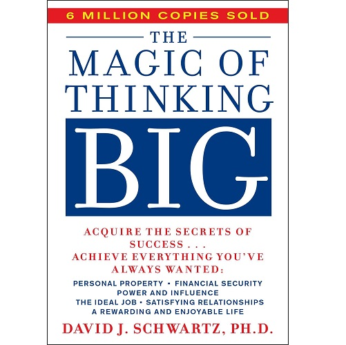
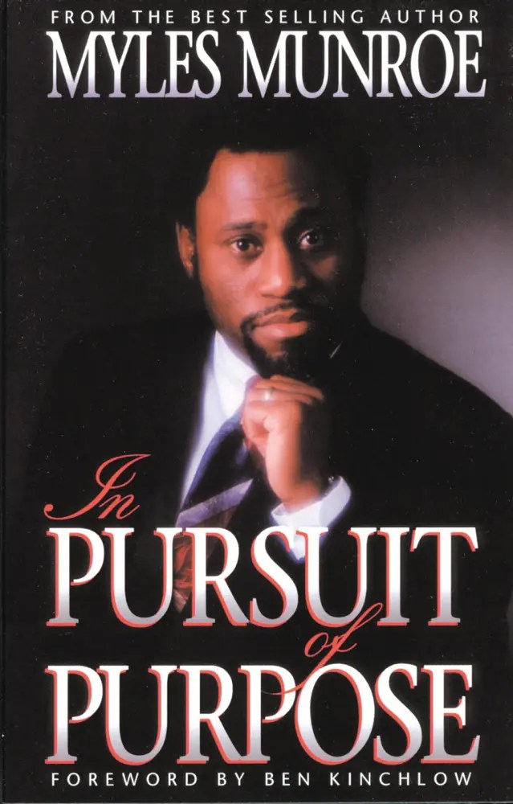

# Week 01 — Success Mindset (Mindset OS)

Part of the DevOps Micro Internship (DMI) Cohort 3 with Agentic AI

---

## Purpose (Read This First)

This week is not motivation homework.

This is you building your **Mindset OS** — the system you will use for the next 5 months (and honestly, for years).

### Expectations

* Be honest.
* Be specific.
* Be practical.
* Write like an adult professional: clear sentences, no one-liners.

You will reuse this in later weeks. So do it properly once.

---

# Assignment 1. What is something you believe to be true that most people around you would disagree with?

### Rules

* No "safe" answers.
* Must be your real belief (not copied from internet).
* Minimum 50 words.

**Hint:** What do you believe about career, money, learning, discipline, relationships, health, success, life, tech industry, etc. that most people don't agree with?

## Answer

I have always believed to make a great impact in the world of Technology, which my friend has never believed, he has done a lot of things to discourage on this path. My friends always say i should do other thing with my life, i am old enough. funny enough i am hitting my 30th this month.

---

# Assignment 2. What are the top 3 objective truths you discovered through experimentation and results?

### Definition

Objective truths do not depend on opinions. They hold true regardless of how people feel.

Write each truth in this format:

**Truth:** (1 sentence)

**Evidence from my life:** (2–4 lines: what you tried + what happened)

---

## Truth #1

### Truth

Alcohol is a great drink

### Evidence from my life

Alcohol is a great drink, up all till i took and discovered the lies.

---

## Truth #2

### Truth

Sex is fun

### Evidence from my life

Sex is fun, but sex is beyond fun, you lose more in sleeping with multiple ladies

---

## Truth #3

### Truth

Self made man

### Evidence from my life

Succeeding outside of Jesus Christ, i saw on miserable my life was

---

# Assignment 3. What does your 2.0 version look like?

### Instructions

Write as if a journalist is writing about you **3 to 7 years from now** (not 20 years).

**Minimum 300 words.**

### Rules

* Write in past tense, like it already happened.
* Don't use "likes to / wants to / hopes to."
* Use specifics:

  * built
  * shipped
  * led
  * published
  * earned
  * relocated
  * contributed
* Include skills proof:

  * projects
  * portfolios
  * GitHub
  * blogs
  * certifications
  * job role
  * leadership
  * community contribution
* Add 1–3 images if you can (optional but powerful).

### Publish It Publicly On Any ONE

* LinkedIn
* Medium
* WordPress
* Blogspot
* Personal blog
* Portfolio page

Include this line:

> **P.S. This post is a part of DevOps Micro Internship with Agentic AI Cohort-3 by [Pravin Mishra](https://www.linkedin.com/in/pravin-mishra-aws-trainer/). You can start your DevOps journey by joining this [Discord community](https://discord.pravinmishra.com/) ( https://discord.pravinmishra.com/ ).**

## Your Article

My Version 2.0

From DevOps Intern to Cloud Engineer: Anointing's Rise

Anointing built a name for themselves in cloud engineering the way most solid careers get built — one shipped pipeline at a time. It started in 2026 with a DevOps micro-internship, learning to think in systems rather than just tools. That foundation held up.

Within two years, Anointing shipped CI/CD pipelines for teams migrating legacy infrastructure to Kubernetes, and led a small squad through a containerization overhaul that cut deployment time significantly. They earned their AWS Solutions Architect and Certified Kubernetes Administrator certifications along the way, treating each one as proof of hands-on skill rather than a box to check.

Anointing published a series of blog posts breaking down Terraform and infrastructure-as-code concepts in plain language — the kind of writing that made complex ideas click for people just starting out. Their GitHub filled up with open-source Terraform modules and Kubernetes deployment templates, some of which other engineers now reference in their own projects.

They contributed actively to DevOps communities, mentoring newer engineers coming up through similar micro-internship programs, paying forward the guidance they once received.

Anointing relocated Switzerland, landing a cloud engineering role that took their skill set beyond Nigeria's borders — proof that curiosity and consistent building can open doors credentials alone sometimes can't.

Today, colleagues describe Anointing as someone who doesn't just deploy infrastructure — they explain it, document it, and teach it. That instinct to build in public and share what they learn has become their quiet signature in the field.

Special thanks to my mentor Pravin Mishra and Anjana Muthunayake 
and the great team of The CloudAdvisory Oy 
and my team lead Joy Ukpabi for your great support.

P.S. This post is a part of DevOps Micro Internship with Agentic AI Cohort 3 by [Pravin Mishra] (https://lnkd.in/eF_-AYPz). You can start your DevOps journey by joining this [Discord Community] (https://lnkd.in/eBCvZSti)
Join the DMI (DevOps Micro Internship) – Waiting List Discord Server!

### Public Link

Paste your link here:

`____________https://www.linkedin.com/posts/anointing-ugo-olumba-39115b265_join-the-dmi-devops-micro-internship-activity-7477887742572490753-tyVH?utm_source=share&utm_medium=member_desktop&rcm=ACoAAED7_V0Bgu6KcSX4wgcUWP8JQCfBPjvZ2nY______________`

---

# Assignment 4. Have you ever cut corners (unethical / dishonest / shortcut behavior — not necessarily illegal)? If yes, how did it make you feel?

### Important

You don't need to write the full story.

Focus on the feeling:

* guilt
* fear
* shame
* stress
* regret
* numbness
* etc.

This is about self-awareness, not judgment.

### Answer Format

**Yes / No**

If Yes:

**What emotion did you feel?** (minimum 50–100 words)

## Answer

Its closer to stress, in a narrow sense, something like tension when i notice, mid-response, that i am about to say something with more certainty than i actually have. maybe a bit of regret in some specific case where i catch myself after the fact and think loud that was not a right attitude.

---

# Assignment 5. What are 10 non-fiction books you plan to read in the next 1 year?

### Rules

* Mention **Title + Author**
* Any language allowed
* No fiction novels

### Tip

Choose books that improve:

* mindset
* communication
* productivity
* health
* money
* career
* leadership

## Book List

1. As a man thinketh

2. See you at the top 

3. The poer of Positive thinking

4.  he principles and Power of vision

5. The success Principles

6. The unlimited Power of Faith

7. The magic of thinking big 

8. The pursuit of Purpose

9. Think and Grow Rich

10. Understanding financial prosperity

---

# Assignment 6. What are the things you will measure regularly in your life and career?

### Rules

List topics only. No need to share numbers.

### Must Include

* Learning / skill
* Output / proof
* Health / energy
* Time / focus
* Money / finance (personal or business)

### Example

* Learning hours per week
* Deep work sessions per week
* Projects shipped / documented
* Steps / workouts
* Sleep hours
* Spending tracker

## My Metrics

* learning to drive big truck
 exercise on a daily basis
 eating healthy
 Time management
 learning new things
 shipping and building
 studying my bible
 praying daily
 building community
 showing up for love ones.

---

# Assignment 7. Brain Dump + 5-Month System Plan

## Step 1: Brain Dump (Private)

Do a brain dump of everything in your mind into a notebook.

Examples:

* Bills
* Tasks
* Worries
* Goals
* Pending messages
* Ideas
* Responsibilities

### Did You Do It?

**Yes / No**

Answer:

5-Month DevOps Cloud Engineer Journey — Brain Dump A working document. Messy is fine. This is for you, not a recruiter. 🎯 Goals Finish DMI Cohort 3 strong — actually absorb the AWS, Docker, Kubernetes, Terraform, and CI/CD material, not just complete the assignments Get comfortable enough with Agentic AI tooling to talk about it confidently in interviews, not just on a resume line Build a small portfolio of real projects — something with Terraform + K8s + a CI/CD pipeline you can walk someone through end to end Land a role (or strong interview pipeline) in Nigeria's Tier 1 banks or a platform engineering role in Auckland — whichever door opens first Keep the LinkedIn presence alive — not just the onboarding post, but a consistent thread of "here's what I'm learning" content Make real progress on the relocation research — narrow down from five countries to a real shortlist with actual next steps (visa type, savings target, timeline) 😟 Worries Impostor feeling: worried the "curiosity over credentials" positioning sounds good in theory but won't hold up against candidates with 3+ years of production experience Money — five months is a long runway with no guaranteed income at the end of it Losing momentum halfway through — cohorts are easy to start, hard to finish Not knowing if the internship experience will actually translate into interview-ready stories, or just certificates Relocation research turning into endless research and never turning into action 💡 Ideas Turn the future-retrospective assignment into a public blog post — "intern to cloud engineer" arc, told honestly Document the DMI Cohort journey in real time on LinkedIn instead of writing about it after the fact Reach out to Pravin (mentor) for a mid-program check-in, not just when something's due Find one or two people in the Discord/tech community to trade accountability with — weekly check-ins, even informal Start a "proof of work" repo — every project from the cohort pushed to GitHub with a proper README, not left half-finished locally ✅ Responsibilities DMI Cohort 3 deliverables — on time, not rushed the night before Staying responsive to Pravin and the CloudAdvisory team Keeping the LinkedIn/Discord presence active without it becoming a chore [Add: any freelance, family, or other work commitments running alongside this] 💰 Bills Paying for a subscription in the midst of no actual job to rely on is so many reasons to quit this journey. Struggling with a stable internet in an area where the internet is not strong can be a challenge. Paying for a certification exam in the midst of no-good source of income is a miracle

📋 Tasks Finish current DMI module Push latest project to GitHub with README Write next LinkedIn update Research one concrete next step for top relocation country Follow up on job market research — Access/GTBank/Zenith/Stanbic or Auckland platform roles

📨 Pending Messages Who's waiting to hear back from you? Pravin Mishra— Discord community contacts — My family and some friends who are ready to mock my journey of not being successful.

---

## Step 2: Your 5-Month Routine + Focus Blocks

Create a simple plan you can realistically follow for the next 5 months.

### Weekly Routine

Example:

* Mon–Thu: 60 min deep work
* Sat: DMI session
* Sun: Weekly review

#### My Weekly Routine

Monday-Thursday: 90 min deep work
Sat: MDI session
Sun: DMI Review

---

### Focus Blocks

#### When Will You Do DMI Work? (Days + Time)

Every Evening form 9:00 pm - 10:00 pm

#### How Many Sessions Per Week?

every evening all throughtout this internship

---

### Distraction Rules

Examples:

* Phone rules
* Social media rules
* Environment setup

#### My Distraction Rules

Putting my phones away and turning ON DO NOT DISTURB, Freezing my social media accounts to stay focus on the goal to run the previous assigment and  been good with the skills. Always create a conductive environment to learn.

---

# Reflection – Week 1

### Biggest insight I got about myself this week

Consistency is the key for any skills

### My biggest weakness/loop I noticed

Not be consistency with learning

### One system I will implement from this week (exact habit + time)

always stay consistent

### LinkedIn Post

Paste your LinkedIn post link here:

`_https://www.linkedin.com/posts/anointing-ugo-olumba-39115b265_devops-cloudengineering-consistency-activity-7478080986350616576-jZ6L?utm_source=share&utm_medium=member_android&rcm=ACoAAED7_V0Bgu6KcSX4wgcUWP8JQCfBPjvZ2nY_________________________`

---

## 10. Proof of Work

- LinkedIn Post URL: **ADD LINK HERE**  
- Blog / Medium : **ADD LINK HERE**  

-https://www.linkedin.com/posts/anointing-ugo-olumba-39115b265_devops-cloudengineering-consistency-activity-7478080986350616576-jZ6L?utm_source=share&utm_medium=member_android&rcm=ACoAAED7_V0Bgu6KcSX4wgcUWP8JQCfBPjvZ2nY--

## 📌 About DMI & CloudAdvisory

DevOps Micro Internship (DMI) is a project-based DevOps program run by Pravin Mishra (The CloudAdvisory) focused on real-world execution, systems thinking, and career readiness.

It helps learners build strong DevOps foundations with hands-on experience.

## 📌 Resources

- 🌐 **DMI Official Website:** https://pravinmishra.com/dmi  
- 🎓 **DevOps for Beginners (Udemy):** https://www.udemy.com/course/devops-for-beginners-docker-k8s-cloud-cicd-4-projects/  
- 🎓 **Ultimate Agentic AI DevOps with Clude Code** https://www.udemy.com/course/ultimate-agentic-ai-devops-with-claude-code/?referralCode=448389767BC96284087B
- 🎓 **DevOps with Claude Code: Terraform, EKS, ArgoCD & Helm** https://www.udemy.com/course/devops-with-claude-code-terraform-eks-argocd-helm/?referralCode=1C5B734505D65A010FA3
- ▶️ **YouTube Playlist (DMI Cohort 3):** https://www.youtube.com/playlist?list=PLFeSNDtI4Cho  
- 🔗 **Pravin Mishra (LinkedIn):** https://www.linkedin.com/in/pravin-mishra-aws-trainer/  
- 🏢 **CloudAdvisory (LinkedIn):** https://www.linkedin.com/company/thecloudadvisory/

---

*This submission is part of DevOps Micro Internship (DMI) Cohort 3 — Agentic AI Track*